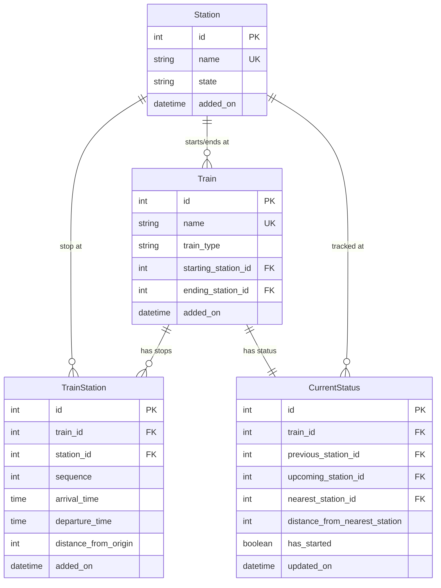

<div align="center">

<!-- Animated Header -->


<br/>

<!-- Typing SVG Animation -->
<a href="https://git.io/typing-svg"></a>

<br/><br/>

<!-- Badges Row 1 -->
[](https://python.org)
[](https://djangoproject.com)
[](https://www.django-rest-framework.org/)
[](https://neon.tech)
[](https://upstash.com)

<br/>

<!-- Badges Row 2 -->
[](LICENSE)
[](http://makeapullrequest.com)
[](https://github.com/adarsh-pathak-2006/where_is_my_train_backend/graphs/commit-activity)

<br/>

<!-- Activity Graph -->


</div>

<br/>

---

## 🎯 Overview

**Where Is My Train (WIMT)** is a high-performance, production-ready REST API built with **Django REST Framework** that provides real-time train tracking, station management, and route enquiry services for the Indian Railway network.

Designed with scalability in mind, the API leverages **Redis caching**, **optimized ORM queries** with `select_related` and `prefetch_related`, and **signal-driven cache invalidation** to deliver sub-millisecond response times under heavy load.

<br/>

<div align="center">

```
   🏗️ Architecture at a Glance
   ═══════════════════════════════════════════════════════════

   Client Request
        │
        ▼
   ┌─────────────┐     ┌──────────────┐
   │   Gunicorn   │────▶│  WhiteNoise  │──▶ Static Files
   │  WSGI Server │     └──────────────┘
   └──────┬──────┘
          │
          ▼
   ┌─────────────┐     ┌──────────────┐
   │   Django     │────▶│ Redis Cache  │  ⚡ Cache Hit → Instant Response
   │   REST API   │     │  (Upstash)   │
   └──────┬──────┘     └──────────────┘
          │
          │ Cache Miss
          ▼
   ┌─────────────┐
   │ PostgreSQL   │  💾 Persistent Storage
   │  (NeonTech)  │
   └─────────────┘
```

</div>

<br/>

---

## ✨ Features

<table>
<tr>
<td width="50%">

### 🚄 Train Management
- Browse all trains with **paginated responses**
- View complete route with all stops, arrival/departure times
- Filter by train type (Superfast, Express, Passenger, MEMU)

</td>
<td width="50%">

### 🏫 Station Management
- Full CRUD for railway stations
- View all trains passing through a station
- State-wise station organization

</td>
</tr>
<tr>
<td width="50%">

### 🔍 Smart Route Enquiry
- Search trains between any two stations
- **Direction-aware** — only returns trains travelling in the correct sequence
- Optimized with **in-memory sequence mapping** (zero N+1 queries)

</td>
<td width="50%">

### 📡 Live Train Status
- Real-time current location tracking
- Previous, upcoming & nearest station data
- Distance from nearest station
- **Validated** — stations must belong to the train's actual route

</td>
</tr>
<tr>
<td width="50%">

### ⚡ Redis Caching Layer
- Automatic caching for train lists, station lists & route data
- **Signal-driven cache invalidation** — cache auto-purges on data changes
- Configurable TTL per resource type

</td>
<td width="50%">

### 🔐 Role-Based Access Control
- **Public endpoints** — anyone can query trains and stations
- **Admin-only endpoints** — data mutations require admin privileges
- Django's built-in auth system for secure access

</td>
</tr>
</table>

<br/>

---

## 🛠️ Tech Stack

<div align="center">

| Layer | Technology | Purpose |
|:---:|:---:|:---:|
|  | **Python 3.14** | Runtime |
|  | **Django 5.2 + DRF** | Web Framework & REST API |
|  | **PostgreSQL (Neon)** | Primary Database |
|  | **Redis (Upstash)** | Caching Layer |
|  | **Gunicorn + WhiteNoise** | Production Server |

</div>

<br/>

---

## 📂 Project Structure

```
wimt/
├── 🔧 wimt/                    # Project configuration
│   ├── settings.py              # Production-ready settings (env vars, Redis, Postgres)
│   ├── urls.py                  # Root URL routing
│   ├── cache_key.py             # Centralized cache key generators
│   ├── pagination.py            # Reusable pagination config
│   ├── wsgi.py                  # WSGI entry point
│   └── asgi.py                  # ASGI entry point
│
├── 🚂 trains/                   # Train management app
│   ├── models.py                # Train & TrainStation models
│   ├── views.py                 # Train list, route & enquiry APIs
│   ├── serializers.py           # DRF serializers with nested station data
│   ├── signals.py               # Auto cache invalidation + status creation
│   └── urls.py                  # Train endpoint routing
│
├── 🏫 station/                  # Station management app
│   ├── models.py                # Station model
│   ├── views.py                 # Station CRUD & trains-at-station API
│   ├── serializers.py           # Station & TrainOnStation serializers
│   ├── signals.py               # Station cache invalidation
│   └── urls.py                  # Station endpoint routing
│
├── 📡 core/                     # Live tracking app
│   ├── models.py                # CurrentStatus model with route validation
│   ├── views.py                 # Real-time status GET & PATCH
│   ├── serializers.py           # Nested read serializer + write serializer
│   └── urls.py                  # Status endpoint routing
│
├── 📄 requirements.txt          # Python dependencies
├── 🔨 build.sh                  # Deployment build script
├── 🔒 .env.example              # Environment variable template
└── 📖 README.md                 # You are here!
```

<br/>

---

## 🚀 API Reference

<details>
<summary><b>🚂 Train Endpoints</b></summary>

<br/>

| Method | Endpoint | Description | Auth |
|:---:|:---|:---|:---:|
| `GET` | `/train/trains/` | List all trains (paginated) | 🌐 Public |
| `GET` | `/train/trains/?page=2` | Paginated train listing | 🌐 Public |
| `GET` | `/train/train/<id>/` | Get all stops for a specific train | 🌐 Public |
| `GET` | `/train/train-enquiry/?from=Delhi&to=Mumbai` | Find trains between two stations | 🌐 Public |

#### Example Response — Train List
```json
{
  "count": 150,
  "next": "http://api.example.com/train/trains/?page=2",
  "previous": null,
  "results": [
    {
      "id": 1,
      "name": "Rajdhani Express",
      "starting_station": {
        "id": 1,
        "name": "New Delhi",
        "state": "Delhi"
      },
      "ending_station": {
        "id": 45,
        "name": "Mumbai Central",
        "state": "Maharashtra"
      },
      "train_type": "SUPERFAST",
      "added_on": "2026-09-13T18:00:00Z"
    }
  ]
}
```

</details>

<details>
<summary><b>🏫 Station Endpoints</b></summary>

<br/>

| Method | Endpoint | Description | Auth |
|:---:|:---|:---|:---:|
| `GET` | `/station/stations/` | List all stations (paginated) | 🌐 Public |
| `POST` | `/station/stations/` | Create a new station | 🔐 Admin |
| `GET` | `/station/stations/<id>/` | Get all trains passing through a station | 🌐 Public |

#### Example Request — Create Station
```json
POST /station/stations/
{
  "name": "Lucknow Junction",
  "state": "Uttar Pradesh"
}
```

</details>

<details>
<summary><b>📡 Live Status Endpoints</b></summary>

<br/>

| Method | Endpoint | Description | Auth |
|:---:|:---|:---|:---:|
| `GET` | `/core/current-status/<train_name>/` | Get real-time train location | 🌐 Public |
| `PATCH` | `/core/current-status/<train_name>/` | Update train location | 🔐 Admin |

#### Example Response — Current Status
```json
{
  "id": 1,
  "train": {
    "id": 1,
    "name": "Rajdhani Express",
    "train_type": "SUPERFAST"
  },
  "previous_station": {
    "id": 12,
    "name": "Kanpur Central",
    "state": "Uttar Pradesh"
  },
  "upcoming_station": {
    "id": 15,
    "name": "Allahabad Junction",
    "state": "Uttar Pradesh"
  },
  "nearest_station": {
    "id": 12,
    "name": "Kanpur Central",
    "state": "Uttar Pradesh"
  },
  "distance_from_nearest_station": 45,
  "has_started": true,
  "updated_on": "2026-09-13T19:30:00Z"
}
```

</details>

<br/>

---

## ⚙️ Quick Start

### Prerequisites

- Python 3.10+
- PostgreSQL (or [Neon](https://neon.tech) free tier)
- Redis (or [Upstash](https://upstash.com) free tier)

### Installation

```bash
# 1. Clone the repository
git clone https://github.com/adarsh-pathak-2006/where_is_my_train_backend.git
cd where_is_my_train_backend

# 2. Create & activate virtual environment
python -m venv venv
source venv/bin/activate        # Linux/Mac
venv\Scripts\activate           # Windows

# 3. Install dependencies
pip install -r requirements.txt

# 4. Configure environment variables
cp .env.example .env
# Edit .env with your Neon DB and Upstash Redis credentials

# 5. Run migrations
python manage.py migrate

# 6. Create a superuser
python manage.py createsuperuser

# 7. Start development server
python manage.py runserver
```

### Production Deployment

```bash
# Using the build script (Render, Railway, etc.)
chmod +x build.sh
./build.sh

# Start with Gunicorn
gunicorn wimt.wsgi:application --bind 0.0.0.0:8000
```

<br/>

---

## 🧠 Performance Optimizations

<div align="center">

```
⚡ What makes this API fast?
═══════════════════════════════════════════════════════════

  📦 select_related()        → Eliminates N+1 on ForeignKey joins
  📦 prefetch_related()      → Batch-loads reverse relations efficiently
  🗄️  Redis Caching           → Sub-millisecond responses for repeat queries
  🔄 Signal-based Invalidation → Cache stays fresh automatically
  🧮 In-memory Sequence Maps  → O(n) route matching, zero extra DB hits
  🔗 Connection Pooling       → conn_max_age=600 reuses DB connections
```

</div>

<br/>

---

## 🗄️ Database Schema



<br/>

---

## 🤝 Contributing

Contributions are what make the open-source community an amazing place to learn, inspire, and create.

1. **Fork** the repository
2. **Create** a feature branch (`git checkout -b feature/AmazingFeature`)
3. **Commit** your changes (`git commit -m 'Add AmazingFeature'`)
4. **Push** to the branch (`git push origin feature/AmazingFeature`)
5. **Open** a Pull Request

<br/>

---

## 📄 License

Distributed under the **MIT License**. See `LICENSE` for more information.

<br/>

---

<div align="center">

## 💬 Connect with Me

[](https://github.com/adarsh-pathak-2006)

<br/>


<br/>

⭐ **If you found this project useful, please consider giving it a star!** ⭐

</div>
